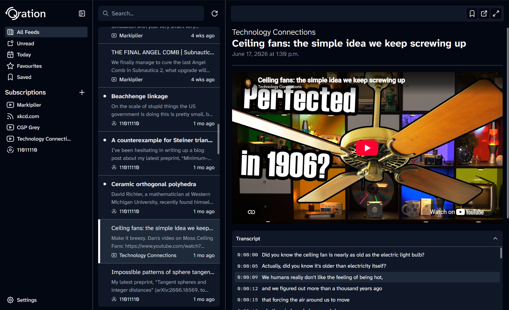
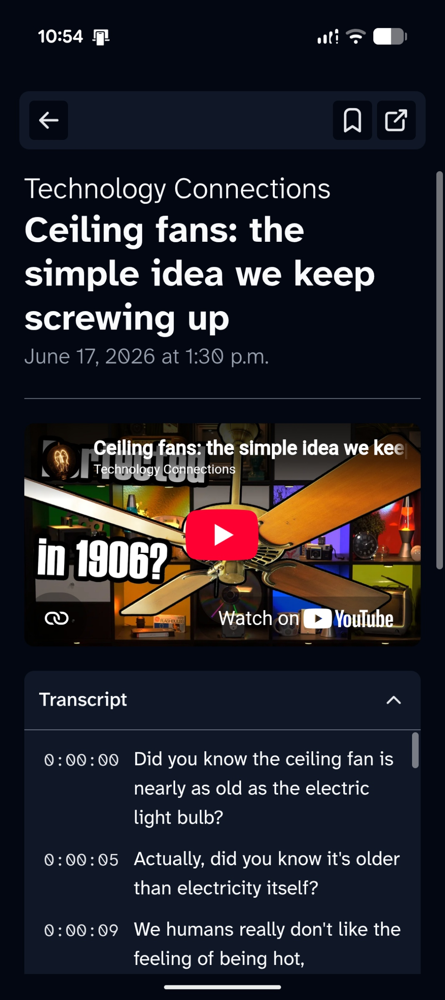

# Qration

Qration is a cross-platform*, privacy-first RSS+ feed reader. Read, watch and listen to exactly what you care about, whenever you want to, without distractions.

Qration is, and always will be, 100% free and open source.

[Official Discord Server](https://discord.gg/9sudXdUdMx)

  

    
  

  

    
  

\* Windows, MacOS, Linux and Android are currently supported.

## Feed Support

- [x] RSS
- [x] Atom
- [x] YouTube
- [ ] Bluesky
- [ ] Podcasts

## Planned Features

- [x] YouTube transcript fetching
- [ ] More support for RSS+ feeds
- [ ] OPML import/export
- [ ] iOS support
- [ ] Opt-in account system
- [ ] Opt-in cloud sync
- [ ] Article snippet sharing
