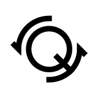
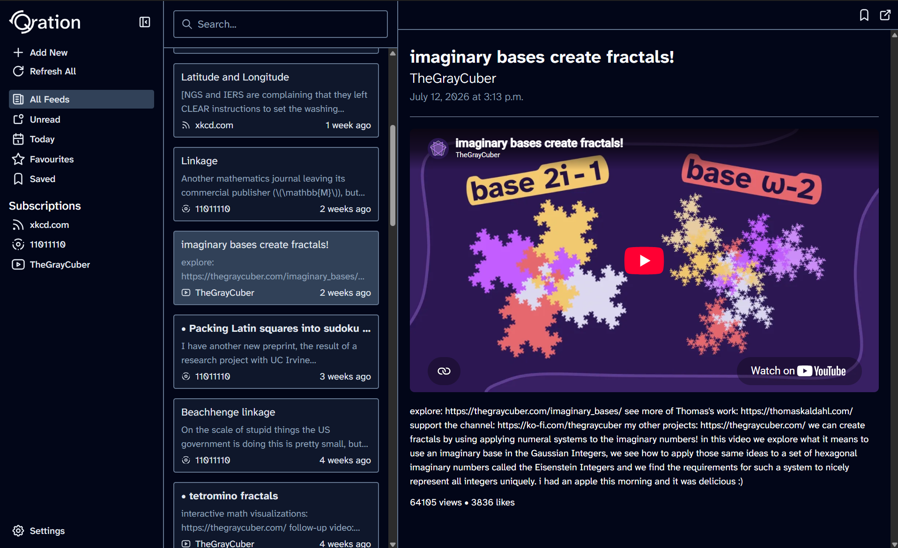

# Qration

Qration is a privacy-first RSS+ feed reader. Read, watch and listen to exactly what you care about, whenever you want to, without distractions.

Qration is, and always will be, 100% free and open source.

[Official Discord Server](https://discord.gg/9sudXdUdMx)

## Feed Support

- [x] RSS
- [x] Atom
- [x] YouTube&dagger;
- [ ] Bluesky
- [ ] Podcasts

&dagger;**Partial support**. Basic info is available, but transcripts are not.

## Planned Features

- [ ] YouTube transcript fetching
- [ ] More support for RSS+ feeds
- [ ] OPML impo!rt/export
- [ ] Opt-in account system
- [ ] Opt-in cloud sync
- [ ] Article snippet sharing
